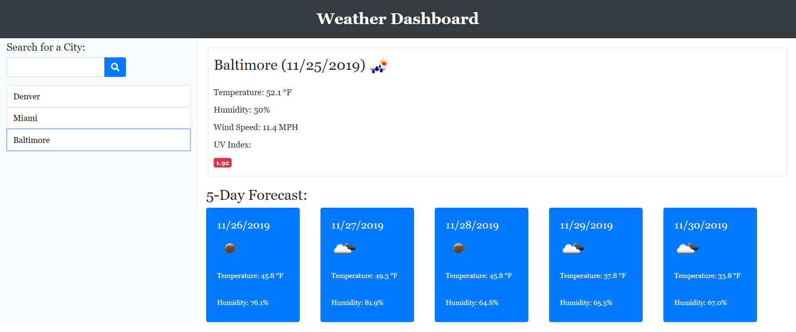

# Might Be Cold (Weather Dashboard)

This repository ("might-be-cold") is a weather dashboard. The user can get the weather information for any city they desire.

Link: https://pmitch242.github.io/might-be-cold/

## Might-Be-Cold Preview

## Usage
The user must type in the city for which they want to know the weather for. Once the user clicks the search button, the city they requested appends as a button. Once the button is pressed, 'Might Be Cold' would generate the current weather information as well as a prediction of the next five days.

## Credits
Johns Hopkins full-Stack Bootcamp

Stetson Lewis

Donald Hesler

## License
MIT License

Copyright (c) 2019 pmitch242

Permission is hereby granted, free of charge, to any person obtaining a copy of this software and associated documentation files (the "Software"), to deal in the Software without restriction, including without limitation the rights to use, copy, modify, merge, publish, distribute, sublicense, and/or sell copies of the Software, and to permit persons to whom the Software is furnished to do so, subject to the following conditions:

The above copyright notice and this permission notice shall be included in all copies or substantial portions of the Software.

THE SOFTWARE IS PROVIDED "AS IS", WITHOUT WARRANTY OF ANY KIND, EXPRESS OR IMPLIED, INCLUDING BUT NOT LIMITED TO THE WARRANTIES OF MERCHANTABILITY, FITNESS FOR A PARTICULAR PURPOSE AND NONINFRINGEMENT. IN NO EVENT SHALL THE AUTHORS OR COPYRIGHT HOLDERS BE LIABLE FOR ANY CLAIM, DAMAGES OR OTHER LIABILITY, WHETHER IN AN ACTION OF CONTRACT, TORT OR OTHERWISE, ARISING FROM, OUT OF OR IN CONNECTION WITH THE SOFTWARE OR THE USE OR OTHER DEALINGS IN THE SOFTWARE.
